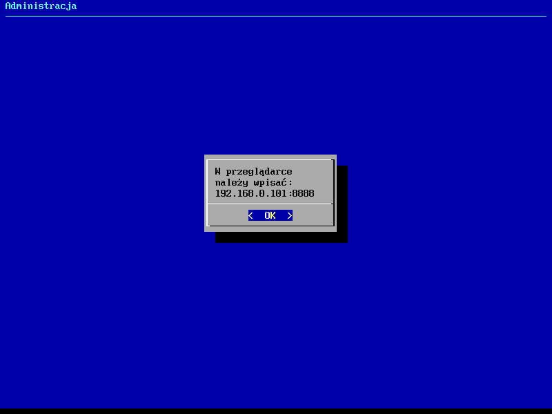
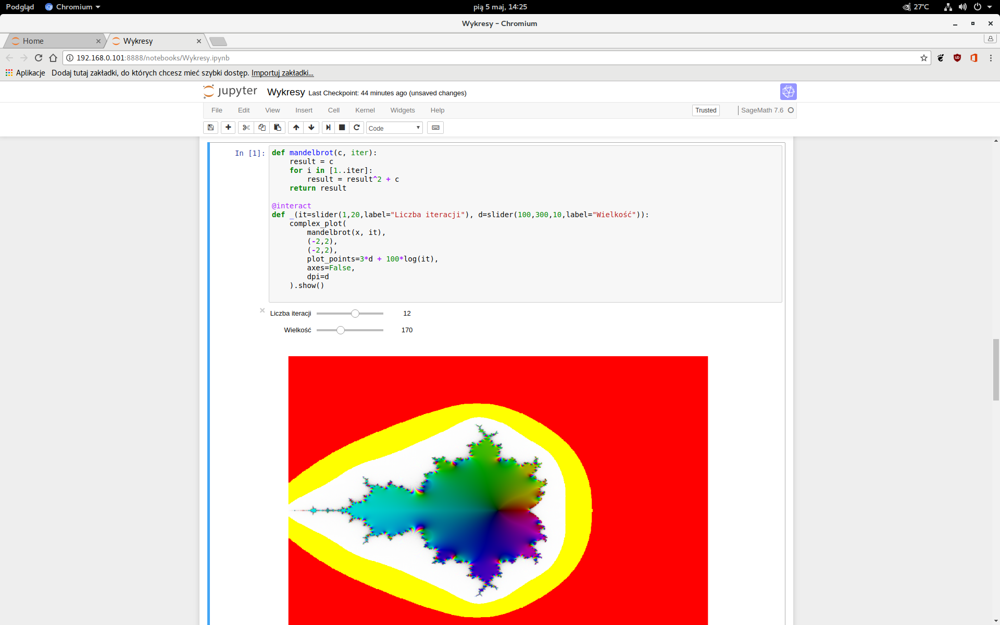

# Jupyter
Repozytorium zawiera pliki użyte do konfiguracji
maszyny wirtualnej z zainstalowanym Jupyterem.
Zainstalowany system to Arch Linux (dokładniej Antergos bez GUI).
Wybór padł na Arch Linuksa ze względu na system wydań (rolling release)
i najnowszą wersję SageMath w repozytorium.

Typ karty sieciowej w programie VirtualBox to `bridged`.

## Pakiety
`jupyter`, `sagemath`, `sage-notebook`, `sagemath-jupyter`,
`jupyter-widgetsnbextension`, `python-pythondialog`, `octave`,
`python-pip`, `nodejs`, `npm`.

`openssh` i `sshfs` do konfiguracji.

`octave_kernel` przez `pip`.
```
# pip install octave_kernel
# python -m octave_kernel.install
```

`ijavascript` przez `npm`.
```
# npm install -g ijavascript
$ ijsinstall
```

## Działanie
Zgodnie z instrukcjami z [ArchWiki](https://wiki.archlinux.org/index.php/Getty#Automatic_login_to_virtual_console)
ustawione jest automatyczne logowanie do `tty1`.
Użytkownik musi nazywać się `admin`.

Do bliku `.bashrc` dodane są dwie instrukcje:
```bash
export PASS=HASŁO_ROOTA
./run.sh
```
Dzięki temu możliwa jest pełna automatyzacja zadań administracyjnych
(`echo $PASS | su -c 'KOMENDY'`).

Skrypt `run.sh` sprawdza, czy w folderze `/home/admin`
istnieje już folder `.juplock`.
Jeśli tak, przerywa pracę. Dzięki temu mamy pewność, że Jupyter nie zostanie
równolegle uruchomiony kilka razy.

Jeśli folder nie istnieje, jest tworzony;
uruchomione zostają Jupyter i panel sterowania.
Panel sterowania zaimplementowany jest w języku Python z użyciem biblioteki
`pythondialog`.

Żeby mieć pewność, że `.juplock` jest usuwany po każdym wyłączeniu maszyny,
uruchomiona jest usługa `jup.service`.
```
# cp jup.service /etc/systemd/system
# systemctl enable jup
```
Wykonuje ona skrypt `.lock_remove` z katalogu `/home/admin`
po każdym uruchomieniu systemu, ale przed logowaniem.

## Użycie
Po uruchomieniu systemu pokazuje się okienko z informacją o adresie IP
w sieci lokalnej.


Po wciśnięciu przycisku ENTER pokazuje się proste menu
(menu jest idiotoodporne, więc przycisk `Anuluj` nic nie robi).


A tak wygląda sytuacja po stronie hosta:

